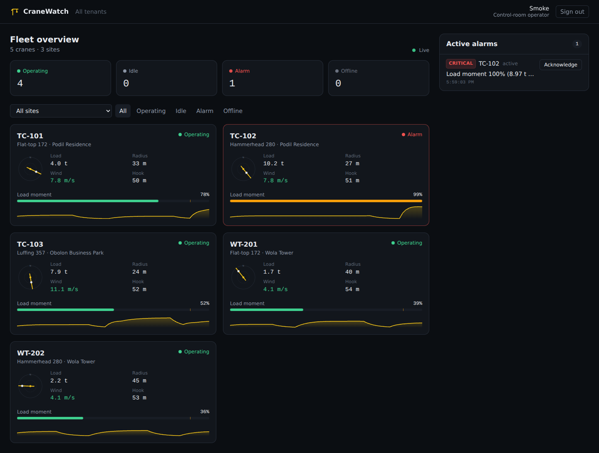
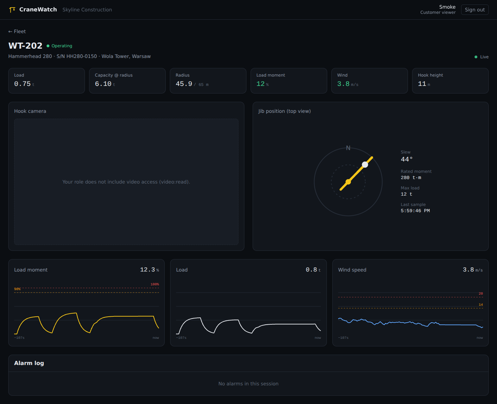
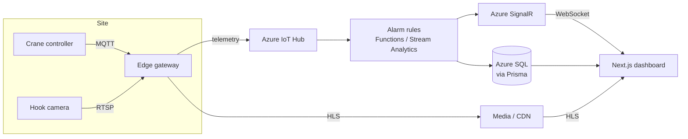

# CraneWatch — tower crane monitoring dashboard (demo)

A small but production-shaped slice of a B2B crane monitoring platform:
**live telemetry, HLS video from site cameras, alarms with acknowledgement, and scope-based multi-tenant access control.**

Stack: **Next.js 15 (App Router) · React 19 · Tailwind CSS v4 · TypeScript · Vitest (Vite) · SignalR client · hls.js · Prisma (SQL Server)**

| Fleet overview | Crane detail |
| --- | --- |
|  |  |

## Run it

```bash
npm install
npm run dev          # http://localhost:3000
npm test             # unit tests (Vitest)
npm run typecheck
```

No database or external services are needed: data comes from an in-memory repository and telemetry from a built-in simulator.
On the sign-in page, pick a user — each one has a different role and tenant:

| User | Role | Tenant | Sees | Video | Ack alarms |
| --- | --- | --- | --- | :-: | :-: |
| Olena | `admin` | all | 5 cranes | ✓ | ✓ |
| Taras | `operator` | all | 5 cranes | ✓ | ✓ |
| Iryna | `customer_manager` | BudInvest | 3 cranes | ✓ | ✓ |
| Piotr | `customer_viewer` | Skyline | 2 cranes | — | — |

## What it demonstrates

**Real-time telemetry.** A transport abstraction (`src/lib/realtime`) with two implementations behind one event contract (`snapshot` / `telemetry` / `alarm`):
- `sse` (default) — Route Handler streaming Server-Sent Events from an in-process hub; heartbeats keep Azure Front Door / App Gateway from idling the connection.
- `signalr` — `@microsoft/signalr` client for an ASP.NET Core hub behind Azure SignalR Service: automatic reconnect with backoff, re-subscribe + fresh snapshot after reconnect (groups are lost), bearer token via `accessTokenFactory` → `/api/realtime/token`.

Switch with `NEXT_PUBLIC_REALTIME=signalr`. The UI reads state through `useSyncExternalStore` over a pure reducer, so components never touch the transport.

**Video.** `HlsPlayer` uses native HLS on Safari/iOS and lazy-loads hls.js elsewhere (kept out of the main bundle), recovers from network/media errors, and shows a retry on fatal ones. Public test streams stand in for camera feeds.

**RBAC and tenant isolation** (`src/lib/auth/rbac.ts`):
- Roles are bundles of scopes (`cranes:read`, `telemetry:read`, `video:read`, `alarms:ack`, `tenants:all`); code checks scopes, never roles.
- Tenant isolation is a separate axis, enforced in one place (`src/lib/access.ts`) for pages, APIs, the SSE stream and Server Actions.
- Other tenants' cranes return **404, not 403**, so ids don't leak between customers.
- Field-level: stream URLs never reach the browser without `video:read`.
- Hiding a button is not authorization — `acknowledgeAlarm` re-checks scope and tenant on the server.

**Auth.** HMAC-signed, httpOnly session cookie using Web Crypto only, so the same code verifies it in Edge middleware and in Node handlers. The demo sign-in stands in for Entra ID / Azure AD B2C; the rest of the app only sees a `Principal`.

**React 19 / Next 15 specifics.** Async `params`/`searchParams`/`cookies()`, Server Actions with `useActionState` (sign-in) and `useOptimistic` + `useTransition` (instant alarm ack with automatic rollback), `<Context value>` without `.Provider`, `use(Context)`.

**Tailwind v4.** CSS-first configuration: design tokens in `@theme`, custom `@utility` classes, no `tailwind.config.js`.

**Domain logic** is pure and tested: the telemetry simulator (seeded PRNG: lift cycles, gusty wind, near-overload lifts, link drop-outs), alarm rules (wind 14/20 m/s, load moment 90/100 %), alarm reconciliation (raise → escalate → clear, no duplicates), and status derivation.

## Architecture



In this demo the left half is replaced by `TelemetryHub` + `TelemetrySimulator`, and SignalR by SSE; the browser-side contract is the same.

```
src/
  app/                    routes: (dashboard) group, login, API route handlers
  components/             client UI: fleet view, crane detail, HLS player, alarm list, SVG charts
  lib/
    auth/                 rbac (scopes, tenant isolation), signed token, session
    data/                 Repository interface: in-memory + Prisma (SQL Server)
    realtime/             transports (SSE, SignalR) + store/reducer
    telemetry/            simulator, alarm rules, hub
    access.ts             single place for tenant-scoped reads
    actions.ts            Server Actions (sign in/out, acknowledge alarm)
  middleware.ts           edge auth gate
prisma/schema.prisma      SQL Server schema + seed
tests/                    Vitest unit tests
```

## SQL Server (optional)

```bash
docker compose up -d mssql
export DATABASE_URL="sqlserver://localhost:1433;database=cranes;user=sa;password=Your_strong_Passw0rd;trustServerCertificate=true"
npm run db:generate && npm run db:push && npm run db:seed
npm run dev
```

With `DATABASE_URL` set, `getRepository()` switches to the Prisma implementation. Raw telemetry is intentionally not stored in SQL Server; the schema keeps hourly aggregates, and high-frequency data belongs in a time-series store (Azure Data Explorer / TimescaleDB).

## Deploy

`Dockerfile` builds a standalone Next.js image (non-root, healthcheck on `/api/health`) for Azure Container Apps or App Service. CI (`.github/workflows/ci.yml`) runs Prisma validation, typecheck, tests and build.

## Next steps for production

- Entra ID / B2C sign-in; tenant and roles from token claims.
- Persist alarms and acknowledgements (audit trail) instead of the in-memory hub.
- Multi-instance fan-out through Azure SignalR (the in-process hub is per instance).
- Signed, short-lived HLS URLs per viewer; per-tenant video access policies.
- Playwright E2E for the role matrix above; OpenTelemetry → Application Insights.
